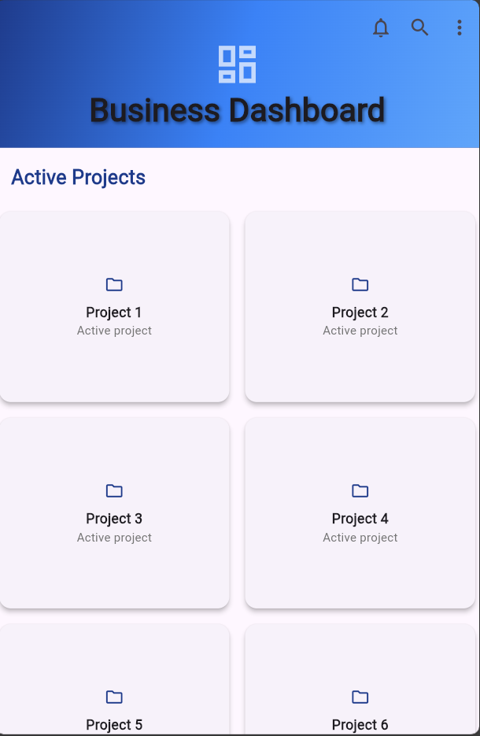

# Flutter SliverAppBar Demo

A Flutter demo showing how `SliverAppBar` creates a dynamic, scroll-aware app bar that expands and collapses as the user scrolls through content.


## Getting Started

Make sure you have Flutter installed. If not, follow the official setup guide at https://docs.flutter.dev/get-started/install.

Clone the repo and run the app:

```bash
git clone https://github.com/briang8/sliverappbar.git
cd sliverappbar/sliver_demo
flutter pub get
flutter run
```

That is all you need. Flutter will detect your connected device/emulator and launch the app automatically.

---

## How It Works

`SliverAppBar` must live inside a `CustomScrollView`. The scroll view manages the relationship between the app bar and the content below it, allowing the bar to react to scroll position in real time.

The three key scroll behavior properties that control its behaviour are:

**pinned** — when set to `true`, the toolbar stays visible at the top even after the header has fully collapsed. The user always has access to the title and action buttons.

**floating** — when set to `true`, the app bar slides back into view as soon as the user starts scrolling upward, without needing to scroll all the way back to the top.

**snap** — when set to `true` alongside `floating`, the app bar snaps fully into view instead of partially appearing. Note that `snap` requires `floating` to also be `true`.

---


---

## Screenshot



---

